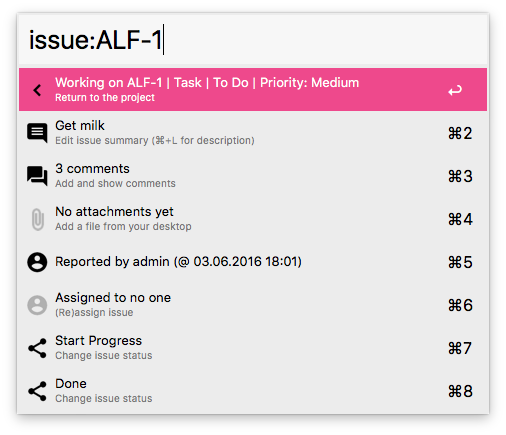

# Alfred-Issues

A Python-powered Alfred 3 workflow for working with issues in Atlassian Jira.

## Screenshot

## Getting Started

In order to start using the workflow, you first need to set up a few environment variables inside Alfred in addition to entering your Jira password in the OS X keychain.

1. Set JIRA_API_URL to the address of the Jira REST API e.g. http://localhost:2990/jira/rest/api/2
2. Set JIRA_ROOT to the root URL for your Jira instance in order to open issues in the browser e.g. http://localhost:2990/jira
3. Set JIRA_USER to your Jira user account name e.g 'admin'
4. Create an application password item in the OS X keychain by filling the name and where fields with the value 'net.raive.alfred-issues'. The account field should match your Jira username (the same you entered in step 3) and the password should contain your Jira password

The keychain item will also be created automatically with a default password of 'admin' when any of the workflow inputs are triggered.

## Features

* Search for all issues within an active project
* Search for all open issues assigned to you
* Create new issues from text on the clipboard
* Keep track and work on recently viewed issues
* Edit and view a subset of issue fields (use 'Large Type' for longer values)
* Upload attachments from your desktop
* Assign issues
* Perform issue transitions
* Copy issue URLs to the clipboard
* Open issues in the default browser

## Limitations

* Supports HTTP Basic authentication only (HTTPS recommended)
* Tested with Jira v5.2.11 and v7.2.0
* Designed as a generic tool around standard features and may not work with highly customized installations

## Dependencies

* [requests](https://pypi.python.org/pypi/requests)
* [requests-futures](https://pypi.python.org/pypi/requests-futures)
* [iso8601](https://pypi.python.org/pypi/iso8601)

## Acknowledgments

* [Material icons](https://design.google.com/icons/) from Google
* [Python library for Alfred workflows](https://github.com/deanishe/alfred-workflow) from Dean Jackson
